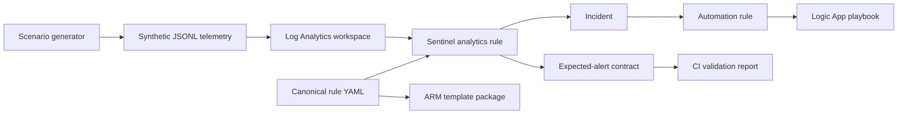

# Sentinel Detection as Code

An end-to-end Microsoft Sentinel engineering lab for building, validating, packaging, deploying, and testing analytics rules as code.

The repository turns five security scenarios into reproducible engineering artifacts: synthetic telemetry, KQL analytics, expected-alert contracts, ARM deployment packages, investigation guidance, and response automation.

## What this demonstrates

- Detection content managed in source control
- Schema-aware validation and automated tests
- Repeatable attack telemetry generation
- MITRE ATT&CK coverage tracking
- Environment-aware ARM packaging
- Development, test, and production promotion
- Sentinel incident automation with Logic Apps
- Versioned release artifacts, deployment verification, and rollback-friendly deployments

## Architecture



## Included scenarios

| Scenario | Data source | Detection outcome | ATT&CK |
|---|---|---|---|
| Password spray followed by success | `SigninLogs` | Correlates distributed failures with a successful sign-in | T1110.003, T1078 |
| MFA fatigue followed by success | `SigninLogs` | Detects repeated MFA denials preceding success | T1621, T1078 |
| Key Vault access anomaly | `AzureDiagnostics` | Finds unusual secret-access volume by a principal | T1555, T1530 |
| Endpoint credential dumping | `DeviceProcessEvents` | Detects suspicious LSASS access and dump tooling | T1003.001 |
| AI agent data exfiltration | `AIApp_CL` | Detects sensitive output sent to an external destination | T1048, T1567 |

## Repository map

```text
analytics-rules/       Canonical Sentinel rule definitions
scenarios/             Reproducible scenario and expected-alert contracts
scripts/               Validate, generate telemetry, package, and deploy
infra/                 Bicep for the Sentinel lab and response playbooks
docs/                  Architecture, operations, testing, and tuning guidance
tests/                 Unit and repository-contract tests
dist/                  Generated deployment artifacts (not committed)
```

## Quick start

Requirements: Python 3.11+, PyYAML, Azure CLI, and Bicep for deployment.

```bash
python -m pip install -r requirements-dev.txt
python scripts/validate.py
python -m unittest discover -s tests -v
python scripts/generate_telemetry.py --all --output build/telemetry
python scripts/package_rules.py --environment dev --output dist/dev
```

Deploy the lab infrastructure and packaged analytics rules:

```bash
az deployment group create \
  --resource-group <resource-group> \
  --template-file infra/main.bicep \
  --parameters environment=dev location=eastus

./scripts/deploy.sh dev <resource-group> <workspace-name>
```

Deployment is intentionally separate from pull-request validation. CI can validate and package content without Azure credentials; deployment uses GitHub environments and Azure workload identity federation.

## Detection lifecycle

1. Create or modify a rule in `analytics-rules/`.
2. Add representative events and assertions in `scenarios/`.
3. Run validation and tests locally.
4. Open a pull request and review the generated coverage report.
5. Merge to package the rules as deployable ARM templates.
6. Promote the same package through `dev`, `test`, and `prod` environments.
7. Tune thresholds through environment parameter files—not direct portal edits.

See [the authoring guide](docs/rule-authoring.md), [deployment guide](docs/deployment.md), [Azure and GitHub OIDC bootstrap guide](docs/azure-oidc-bootstrap.md), and [testing model](docs/testing.md).

After an Azure deployment, run the **Verify deployed Sentinel content** workflow to compare deployed rule properties with the canonical YAML. The weekly drift workflow performs the same read-only comparison for the configured `dev` environment.

## Safety

The generators create synthetic records only. They do not perform password attacks, credential dumping, data exfiltration, or changes to production identities. Use an isolated lab subscription and review generated artifacts before deployment.

## License

MIT. See [LICENSE](LICENSE).
