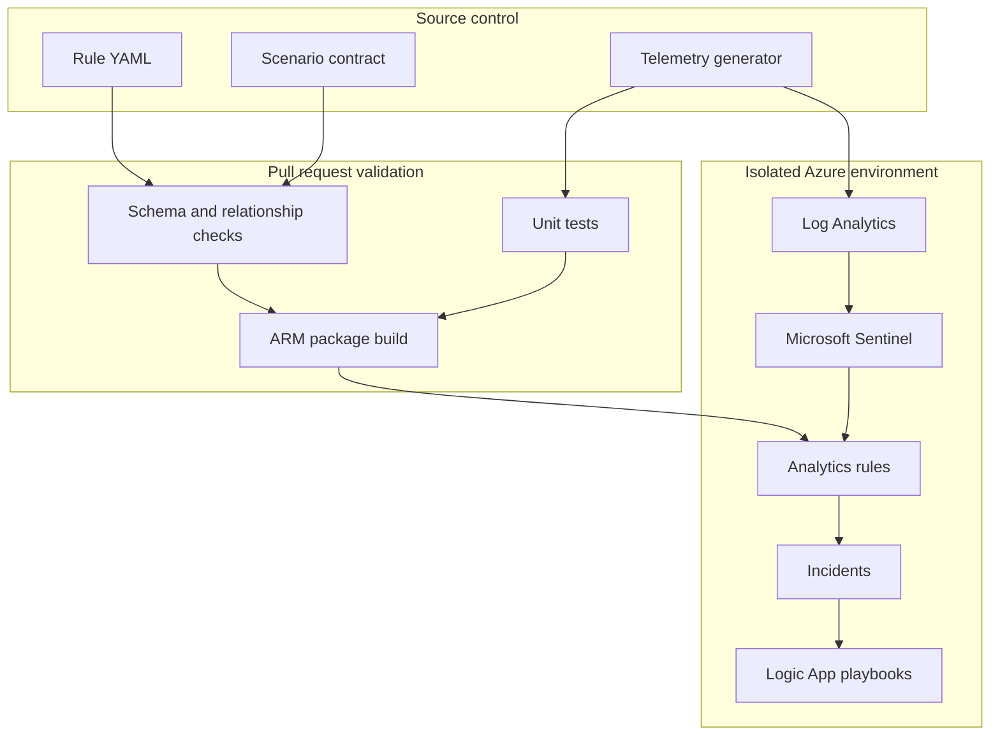

# Architecture

The repository separates authoring, packaging, and deployment so the same reviewed content moves between environments without manual portal edits.

## Trust boundaries

- Pull-request jobs do not receive Azure credentials.
- Deployment uses GitHub environment approval and federated identity.
- Synthetic data contains reserved documentation domains and addresses.
- Playbooks deploy in simulation mode and have no destructive connector actions.
- Production thresholds are reviewed in source control.

## Content ownership

Rule YAML is canonical. Generated ARM templates are disposable release artifacts. Editing a rule in the Sentinel portal creates drift and should be reconciled back into source control or overwritten by the next deployment.
